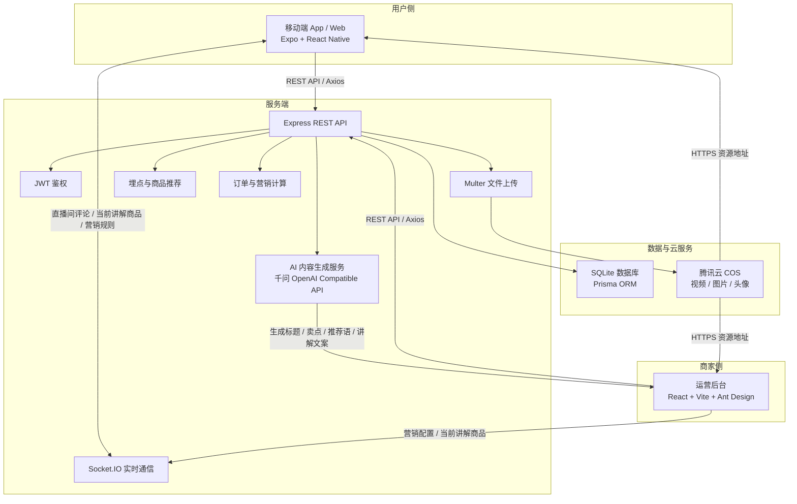
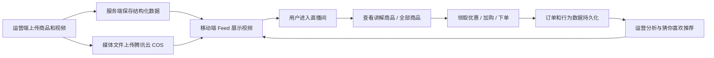
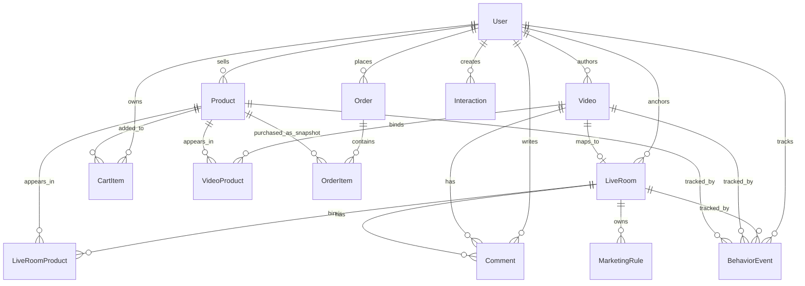
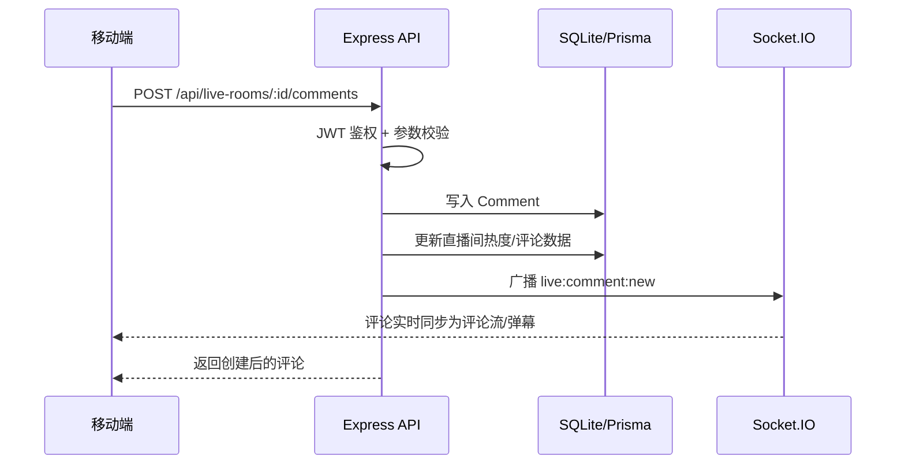
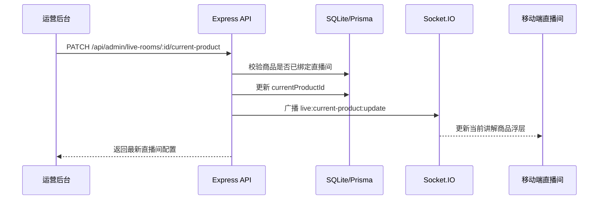
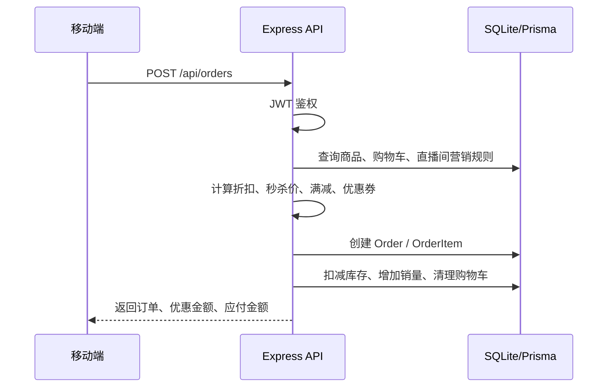
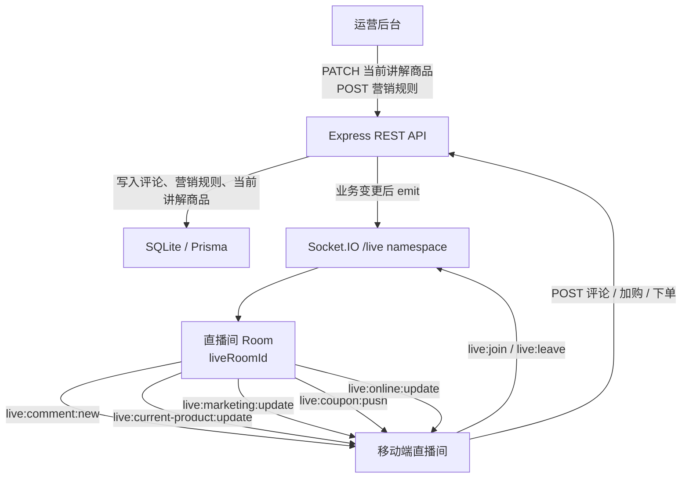

# 直播带货短视频购物系统项目复盘

## 1. 项目概述

本课题完成了一个面向直播带货场景的内容电商 MVP，覆盖移动端用户体验、商家/运营后台、后端 API、数据持久化、云存储、AIGC 内容生成、营销玩法、埋点与推荐基础设施等核心环节。

项目最初从“移动端短视频带货”出发，逐步扩展为一套端到端系统：

- 用户在移动端浏览短视频，进入模拟直播间，查看商品、评论互动、加购、下单。
- 商家在运营后台管理商品、短视频、直播间配置、营销玩法和数据分析。
- 服务端统一承载用户、商品、视频、直播间、购物车、订单、评论、互动、埋点等数据。
- 视频、商品图片、头像等媒体资源接入腾讯云 COS。
- 内容管理模块接入千问大模型，用于生成短视频标题、卖点、推荐语和直播讲解文案。

目前项目已经具备较完整的内容电商闭环，适合作为课题原型、演示系统和后续毕业设计/产品迭代基础。

## 2. 整体完成情况

### 2.1 移动端

移动端基于 Expo + React Native 实现，主要完成：

- 短视频 Feed 流浏览。
- 视频点赞、收藏、评论、转发。
- 未登录拦截与测试用户自动登录。
- 商品卡片、商品半屏弹窗、商品详情页。
- 购物车、数量调整、删除、选择结算。
- 订单确认、模拟支付、订单列表、订单状态筛选。
- 模拟直播间：
  - 评论展示。
  - 评论同步为弹幕。
  - 弹幕开关。
  - 评论区最多显示 5 条，多余内容可滑动。
  - 暂停、静音。
  - 当前讲解商品浮层。
  - 全部商品列表。
  - 直播间购物车入口。
  - 直播间营销玩法展示。
- 直播间退出时支持小窗播放。
- Feed 下一个视频轻量预加载。
- “我”页面支持修改昵称、设置头像、从本地相册上传头像到腾讯云 COS。
- 用户头像、昵称更新后同步到运营端作者/主播信息。

### 2.2 运营后台

运营后台基于 React + Vite + Ant Design 实现，定位为“当前用户自己的商家运营端”，不是平台级后台。

主要完成：

- 后台登录，复用移动端用户体系。
- 仪表盘概览：
  - 商品数。
  - 视频数。
  - 订单数。
  - GMV。
- 内容管理：
  - 上传短视频。
  - 设置标题。
  - 上传本地视频并保存到腾讯云 COS。
  - 绑定商品。
  - 设置内容状态：草稿、已发布、已下架。
  - 设置直播间标题。
  - 当前讲解商品从关联商品中选择。
  - 内容与直播间配置合并，每个短视频都可作为模拟直播间。
- 商品管理：
  - 商品列表展示。
  - 新增、编辑商品。
  - 上下架商品。
  - 商品图片上传到腾讯云 COS。
  - 商品绑定到短视频或直播间。
- 营销配置：
  - 优惠券。
  - 限时折扣。
  - 满减。
  - 秒杀倒计时。
  - 规则实时同步到客户端直播间。
- 运营分析：
  - 视频播放、点赞、评论趋势。
  - 商品曝光、点击、加购、下单转化漏斗。
  - 视频 GMV 排行。
  - 热门商品 Top10。
  - 当前阶段使用 mock 数据展示分析能力。
- AIGC 能力：
  - 根据商品信息生成短视频标题。
  - 生成商品卖点。
  - 生成商品推荐语。
  - 生成直播讲解文案。
  - 支持弹窗展示生成结果。
  - 支持下载生成文档。

### 2.3 服务端

服务端基于 Node.js + Express + Prisma + SQLite + Socket.IO 实现。

主要完成：

- 用户注册、登录、测试登录。
- JWT 鉴权。
- 用户资料更新。
- 头像上传到腾讯云 COS。
- 商品、视频、直播间、购物车、订单、评论、互动等 API。
- 订单金额计算、库存扣减、销量更新。
- 直播间营销规则计算。
- Socket.IO 实时事件：
  - 评论同步。
  - 当前讲解商品同步。
  - 营销规则同步。
  - 优惠券推送。
  - 在线人数/热度更新。
- 腾讯云 COS 上传：
  - 视频。
  - 商品图片。
  - 直播封面。
  - 用户头像。
- 千问大模型 API 调用封装。
- 行为埋点接口。
- SQLite 数据持久化。

### 2.4 数据持久化

目前已持久化的数据包括：

- 用户信息。
- 商品信息。
- 视频信息。
- 直播间配置。
- 商品与视频绑定关系。
- 商品与直播间绑定关系。
- 购物车。
- 订单。
- 评论。
- 点赞、收藏。
- 转发数。
- 营销规则。
- 行为埋点事件。

核心 Prisma 模型包括：

- `User`
- `Product`
- `Video`
- `LiveRoom`
- `VideoProduct`
- `LiveRoomProduct`
- `CartItem`
- `Order`
- `OrderItem`
- `Comment`
- `Interaction`
- `BehaviorEvent`
- `MarketingRule`
- `Coupon`

## 3. 关键架构设计

### 3.1 Monorepo 项目结构

项目采用 monorepo 结构：

```text
apps/
  mobile/   Expo React Native 移动端
  admin/    React + Vite + Ant Design 运营后台
  server/   Express + Prisma 服务端
docs/       项目文档
```

这种结构的优势是：

- 三端代码统一管理。
- 本地开发启动简单。
- 数据模型和接口协同调整成本低。
- 适合快速迭代 MVP。

### 3.2 整体项目架构图

项目整体采用“移动端 + 运营后台 + 服务端 + 数据库 + 云服务”的架构。移动端和运营端不直接操作数据库，也不直接持有腾讯云 COS 密钥，而是通过服务端统一完成鉴权、业务校验、文件上传、实时同步和数据持久化。



从业务流转角度看，项目的核心闭环如下：



### 3.3 三端职责划分

移动端负责用户侧消费体验：

- 内容浏览。
- 商品转化。
- 直播互动。
- 下单支付模拟。

运营后台负责商家侧生产和运营：

- 商品维护。
- 内容上传。
- 直播配置。
- 营销玩法。
- 数据分析。
- AIGC 辅助创作。

服务端负责统一业务能力：

- 鉴权。
- 数据持久化。
- 文件上传。
- 订单计算。
- 实时同步。
- AI 调用。
- 埋点采集。

这种划分保证了用户端和运营端使用同一套后端数据，不会出现“两套系统各玩各的”的问题。

### 3.4 内容与直播间合并设计

项目中途对业务逻辑做过一次关键调整：上传的视频都可以当作直播素材，因此内容管理和直播间配置不再拆成完全独立的两套模块。

最终设计为：

- `Video` 表保存短视频基础信息。
- `LiveRoom` 表保存该视频对应的直播间配置。
- `LiveRoom.videoId` 与 `Video.id` 建立关联。
- 用户在 Feed 浏览视频时，可以点击进入该视频对应的模拟直播间。
- 运营端编辑内容时，同时维护直播标题、关联商品、当前讲解商品和营销规则。

这个设计解决了两个问题：

- 避免运营后台重复配置同一个素材。
- 保持用户看到的视频内容与直播间内容一致。

### 3.5 商品绑定设计

商品既可以绑定到短视频，也可以绑定到直播间：

- `VideoProduct` 表维护视频与商品的多对多关系。
- `LiveRoomProduct` 表维护直播间与商品的多对多关系。
- 当前讲解商品通过 `LiveRoom.currentProductId` 保存。

客户端展示逻辑：

- Feed 商品卡展示视频关联商品中的第一个。
- 直播间“全部商品”展示直播间关联商品。
- 当前讲解商品浮层展示 `currentProductId` 对应商品。
- 运营端修改当前讲解商品后，通过 Socket.IO 同步到客户端。

### 3.6 营销规则设计

营销玩法统一抽象为 `MarketingRule`：

```text
type: COUPON | DISCOUNT | FULL_REDUCTION | SECKILL
status: ACTIVE | INACTIVE
productId: 可选，不填表示全场生效
amount: 优惠金额
minAmount: 门槛金额
discountPercent: 折扣百分比
countdownSeconds: 秒杀倒计时
```

规则计算顺序：

1. 先计算折扣和秒杀价。
2. 再计算满减。
3. 再计算优惠券。
4. 最终生成优惠金额和应付金额。

这样可以支持“折扣后再满减”的常见电商逻辑。

### 3.7 行为埋点设计

为了后续智能推荐，项目新增轻量埋点表 `BehaviorEvent`。

已采集事件包括：

- `video_view`
- `video_play_progress`
- `video_like`
- `video_favorite`
- `video_share`
- `live_enter`
- `product_view`
- `product_click`
- `product_list_open`
- `cart_open`
- `cart_add`
- `cart_update`
- `cart_remove`
- `checkout_start`
- `order_create`
- `coupon_claim`

埋点字段包括：

- 用户。
- 事件类型。
- 目标类型。
- 视频 ID。
- 商品 ID。
- 直播间 ID。
- 类目。
- 价格。
- 数量。
- 来源。
- 元数据。

这为后续“猜你喜欢”推荐提供了数据基础。

### 3.8 数据库设计

项目数据库使用 Prisma + SQLite。SQLite 适合当前开发测试阶段，具备轻量、无需单独部署、便于本地调试的优势；Prisma 负责数据模型定义、类型生成和数据库访问。后续如果进入生产环境，可以平滑迁移到 MySQL 或 PostgreSQL。

数据库设计围绕“用户、内容、商品、直播间、交易、互动、营销、埋点”展开。



核心数据表设计如下：

| 模型 | 作用 | 关键字段 |
| --- | --- | --- |
| `User` | 用户与商家账号，移动端和运营端共用 | `username`、`phone`、`nickname`、`avatarUrl`、`passwordHash` |
| `Product` | 商品基础信息 | `title`、`coverUrl`、`price`、`stock`、`sales`、`status`、`category`、`sellerId` |
| `Video` | 短视频内容，同时可作为模拟直播素材 | `title`、`coverUrl`、`videoUrl`、`authorName`、`status`、`playCount`、`likeCount`、`commentCount`、`shareCount` |
| `LiveRoom` | 模拟直播间配置 | `videoId`、`title`、`coverUrl`、`videoUrl`、`anchorName`、`currentProductId`、`status` |
| `VideoProduct` | 视频与商品多对多关系 | `videoId`、`productId`、`sort` |
| `LiveRoomProduct` | 直播间与商品多对多关系 | `liveRoomId`、`productId`、`sort` |
| `CartItem` | 用户购物车 | `userId`、`productId`、`quantity`、`selected` |
| `Order` | 订单主表 | `orderNo`、`userId`、`status`、`totalAmount`、`discountAmount`、`payAmount`、`liveRoomId` |
| `OrderItem` | 订单商品快照 | `orderId`、`productId`、`title`、`coverUrl`、`price`、`quantity` |
| `Comment` | 视频和直播间评论 | `content`、`userId`、`videoId`、`liveRoomId` |
| `Interaction` | 点赞、收藏等互动关系 | `userId`、`targetType`、`targetId`、`type` |
| `BehaviorEvent` | 行为埋点事件 | `userId`、`eventType`、`videoId`、`liveRoomId`、`productId`、`category`、`price`、`metadata` |
| `MarketingRule` | 直播间营销规则 | `liveRoomId`、`type`、`status`、`productId`、`amount`、`minAmount`、`discountPercent`、`countdownSeconds` |
| `Coupon` | 优惠券基础模型，当前主要作为扩展预留 | `title`、`amount`、`minAmount`、`status` |

数据库设计中的几个重点：

- **账号统一**：移动端用户和运营端商家复用 `User`，运营后台根据当前登录用户过滤商品、视频和直播间数据。
- **内容与直播间关联**：`Video` 保存内容素材，`LiveRoom.videoId` 关联视频，使“上传视频即可作为模拟直播间”成为可能。
- **商品多对多绑定**：通过 `VideoProduct` 和 `LiveRoomProduct` 分别维护内容商品和直播间商品，避免在单表中塞数组字段。
- **订单快照**：`OrderItem` 保存下单时的商品标题、封面和价格，避免后续商品改价影响历史订单。
- **互动去重**：`Interaction` 使用用户、目标类型、目标 ID、互动类型的唯一约束，保证同一用户对同一目标只能有一个点赞或收藏状态。
- **埋点可扩展**：`BehaviorEvent` 保留 `metadata` 字段，用于存储播放进度、来源上下文、推荐位等非固定结构信息。

### 3.9 后端 API 设计

后端采用 Express 提供 REST API，所有业务数据统一通过 `/api` 前缀访问。接口返回结构统一为：

```ts
type ApiResponse<T> = {
  code: number
  message: string
  data: T
}
```

服务端 API 设计遵循以下原则：

- **统一鉴权**：需要用户身份的接口使用 JWT 鉴权中间件，例如购物车、订单、用户资料、评论发布。
- **公共读取与登录行为分离**：视频列表、商品详情、直播间详情可以公开访问；点赞、收藏、加购、下单必须登录。
- **运营端通过 `/api/admin` 分组**：商品管理、内容管理、直播间配置、营销配置、上传能力集中在后台 API 下。
- **文件不直传云端**：前端将文件上传到服务端，服务端再上传腾讯云 COS，避免密钥泄露。
- **实时能力不挤进 REST**：评论广播、当前讲解商品、营销规则同步等通过 Socket.IO 推送，REST 只负责数据落库和查询。

后端 API 模块划分如下：

| 模块 | 代表接口 | 说明 |
| --- | --- | --- |
| 健康检查与媒体代理 | `GET /api/health`、`GET /api/media-proxy` | 检查服务状态，兼容媒体资源访问 |
| 用户认证 | `POST /api/auth/register`、`POST /api/auth/login`、`POST /api/auth/mock-login` | 注册、登录、测试身份登录 |
| 用户资料 | `GET /api/users/me`、`PATCH /api/users/me`、`POST /api/users/me/avatar`、`GET /api/users/:id` | 个人资料、头像上传、用户主页 |
| 消息中心 | `GET /api/messages` | 汇总评论、订单、互动消息 |
| 视频内容 | `GET /api/videos`、`GET /api/videos/:id`、`POST /api/videos/:id/share`、`POST /api/videos/:id/interactions/:type` | Feed 视频、详情、转发、点赞收藏 |
| 视频商品与评论 | `GET /api/videos/:id/products`、`GET /api/videos/:id/comments`、`POST /api/videos/:id/comments` | 视频关联商品和评论 |
| 商品 | `GET /api/products`、`GET /api/products/:id`、`POST /api/products/:id/interactions/:type` | 商品列表、详情、商品互动 |
| 智能推荐 | `GET /api/recommendations/products` | 根据埋点、类目、价格区间和销量生成购物车猜你喜欢 |
| 购物车 | `GET /api/cart`、`POST /api/cart`、`PATCH /api/cart/:cartItemId`、`PATCH /api/cart/:cartItemId/selected`、`DELETE /api/cart/:cartItemId` | 加购、数量调整、选中、删除 |
| 订单 | `POST /api/orders`、`GET /api/orders`、`GET /api/orders/:id`、`POST /api/orders/:id/pay`、`POST /api/orders/:id/cancel` | 下单、订单列表、支付模拟、取消 |
| 直播间 | `GET /api/live-rooms`、`GET /api/live-rooms/:id`、`GET /api/live-rooms/:id/products`、`GET /api/live-rooms/:id/comments`、`POST /api/live-rooms/:id/comments` | 直播间信息、商品、评论 |
| 直播营销 | `GET /api/live-rooms/:id/marketing-rules` | 客户端读取直播间营销规则 |
| 行为埋点 | `POST /api/events` | 记录浏览、点击、加购、下单等行为 |
| 运营概览 | `GET /api/admin/dashboard/overview` | 后台首页数据概览 |
| 运营商品 | `GET /api/admin/products`、`POST /api/admin/products`、`PATCH /api/admin/products/:id`、`PATCH /api/admin/products/:id/status` | 商品列表、新增、编辑、上下架 |
| 运营内容 | `GET /api/admin/videos`、`POST /api/admin/videos`、`PATCH /api/admin/videos/:id`、`PATCH /api/admin/videos/:id/status`、`POST /api/admin/videos/:id/products` | 视频上传、编辑、状态、商品绑定 |
| 运营直播间 | `GET /api/admin/live-rooms`、`POST /api/admin/live-rooms`、`PATCH /api/admin/live-rooms/:id`、`POST /api/admin/live-rooms/:id/products`、`PATCH /api/admin/live-rooms/:id/current-product` | 直播间配置、商品绑定、当前讲解商品 |
| 运营营销 | `GET /api/admin/live-rooms/:id/marketing-rules`、`POST /api/admin/live-rooms/:id/marketing-rules`、`POST /api/admin/live-rooms/:id/push-coupon` | 营销规则配置与优惠券推送 |
| 文件上传 | `POST /api/admin/upload/image`、`POST /api/admin/upload/video` | 商品图、直播封面、视频文件上传 COS |
| AIGC | `/api/ai/*` | 内容生成、商品卖点、推荐语、直播讲解文案 |

典型业务 API 流程如下：







### 3.10 直播间实时通信设计

直播间实时通信使用 Socket.IO 实现。项目中将“数据保存”和“实时推送”做了明确分工：

- REST API 负责业务校验、数据落库和返回结果。
- Socket.IO 负责把直播间内的状态变化实时推送给正在观看的客户端。

整体通信模型如下：



实时通信的关键场景如下：

| 场景 | 触发端 | REST/API 或 Socket 入口 | 服务端处理 | 客户端实时响应 |
| --- | --- | --- | --- | --- |
| 进入直播间 | 移动端 | `live:join` | 将用户加入对应直播间 room，更新在线人数和热度 | 收到 `live:online:update` 后刷新在线人数和人气 |
| 离开直播间 | 移动端 | `live:leave` | 从直播间 room 移除用户，更新在线人数 | 其他客户端收到新的在线人数 |
| 发送直播评论 | 移动端 | `POST /api/live-rooms/:id/comments` | JWT 鉴权，写入 `Comment`，广播 `live:comment:new` | 评论列表新增评论，同时同步为弹幕 |
| 切换当前讲解商品 | 运营端 | `PATCH /api/admin/live-rooms/:id/current-product` | 校验商品已绑定直播间，更新 `currentProductId`，广播 `live:current-product:update` | 直播间商品浮层立即切换 |
| 保存营销规则 | 运营端 | `POST /api/admin/live-rooms/:id/marketing-rules` | 写入 `MarketingRule`，广播 `live:marketing:update` | 优惠券、折扣、满减、秒杀倒计时实时刷新 |
| 推送优惠券 | 运营端 | `POST /api/admin/live-rooms/:id/push-coupon` | 找到直播间优惠券并广播 `live:coupon:push` | 客户端展示可领取优惠券 |

移动端直播间初始化时会连接 `/live` 命名空间，并加入当前直播间：

```ts
socket.connect()
socket.emit('live:join', {
  liveRoomId: room.id,
  userId: user?.id || 'guest',
})
```

随后监听服务端推送的实时事件：

```ts
socket.on('live:comment:new', (comment) => {
  // 写入评论列表，并用于弹幕展示
})

socket.on('live:current-product:update', ({ product }) => {
  // 更新当前讲解商品浮层
})

socket.on('live:marketing:update', ({ rules }) => {
  // 更新优惠券、折扣、满减、秒杀等营销规则
})

socket.on('live:coupon:push', ({ coupon }) => {
  // 展示新推送的优惠券
})

socket.on('live:online:update', ({ onlineCount, heat }) => {
  // 更新在线人数和热度
})
```

离开直播间时会主动发送离开事件，并释放监听，避免重复订阅和内存泄漏：

```ts
socket.emit('live:leave', {
  liveRoomId: room.id,
  userId: user?.id || 'guest',
})

socket.off('live:comment:new')
socket.off('live:current-product:update')
socket.off('live:marketing:update')
socket.off('live:coupon:push')
socket.off('live:online:update')
socket.disconnect()
```

这个设计带来的好处是：

- **一致性更好**：所有关键数据先通过 REST API 写入数据库，再通过 Socket.IO 广播，避免只改前端状态但没有持久化。
- **实时性足够**：评论、弹幕、当前讲解商品和营销规则可以在直播间内即时更新。
- **职责清晰**：REST API 负责“这件事能不能做、数据怎么存”，Socket.IO 负责“把变化告诉正在看直播的人”。
- **扩展方便**：后续可以继续增加点赞飘屏、成交提醒、库存变化、主播开播状态等实时事件。

## 4. 技术难点与解决方案

### 4.1 移动端和 Web/后台多端协同

难点：

移动端使用 React Native/Expo，运营端使用 React/Vite，服务端使用 Express。不同端的运行环境、路由、媒体处理、请求方式都不相同。

解决：

- 后端统一提供 REST API。
- 移动端和运营端共用同一套用户、商品、视频和订单数据。
- 媒体资源统一上传到腾讯云 COS，前端只保存 HTTPS 地址。
- 使用 `toMediaUrl` 统一处理本地媒体和云端媒体地址。
- 运营端登录复用移动端账号体系。

### 4.2 腾讯云 COS 接入

难点：

项目中视频、商品图片、直播封面、头像都需要上传到云端，但密钥不能暴露到前端。

解决：

- COS 密钥只保存在服务端 `.env`。
- 前端通过 `multipart/form-data` 上传文件到服务端。
- 服务端使用 `cos-nodejs-sdk-v5` 上传到 COS。
- 上传成功后返回公开 HTTPS 地址。
- `.gitignore` 忽略真实 `.env`，仓库只保留 `.env.example`。
- 文件路径按不同用途配置不同前缀，例如视频、图片、头像。

### 4.3 手机真机调试

难点：

真机调试中多次遇到：

- Android 设备连接问题。
- 手机访问本机服务地址问题。
- Metro 旧缓存导致错误持续存在。
- 端口反向代理配置问题。

解决：

- 使用 `adb devices` 确认设备连接。
- 使用 `adb reverse tcp:8081 tcp:8081` 让手机访问 Metro。
- 使用 `adb reverse tcp:4000 tcp:4000` 让手机访问后端。
- 移动端 API 在 Android 下使用 `http://localhost:4000`，配合 `adb reverse`。
- 出现依赖或 bundle 异常时，关闭旧 Metro，使用 `expo start --clear` 清缓存重启。
- 使用 `adb logcat` 过滤 `ReactNativeJS` 抓取真实运行错误。

### 4.4 Axios 版本导致移动端运行错误

难点：

安装 `expo-image-picker` 后，`axios` 版本被升级到 `1.16.1`，手机端报错：

```text
Unable to resolve module @babel/runtime/helpers/getPrototypeOf
```

原因是新版 axios 的 React Native/browser bundle 与当前 Metro 解析环境不兼容。

解决：

- 将 `apps/mobile/package.json` 和 `apps/admin/package.json` 中的 axios 固定为 `1.7.7`。
- 重新 `npm install` 更新锁文件。
- 关闭旧 Metro 进程。
- 使用 `--clear` 重启 Metro。
- 重新打开手机端 bundle。

这个问题说明：移动端依赖版本不能随意漂移，尤其是网络库、媒体库、原生模块相关依赖，最好固定版本。

### 4.5 视频播放和直播间互斥

难点：

进入直播间后，Feed 流视频仍可能继续播放，造成多个视频同时播放。

解决：

- Feed 页面维护 `feedPlaying` 状态。
- 进入直播间时设置 `feedPlaying=false`。
- 离开 Feed 时暂停 Feed 播放。
- FeedItem 根据 `active` 与 `feedPlaying` 决定播放或暂停。

后续又加入了轻量预加载：

- 当前视频正常播放。
- 仅下一条视频提前挂载但不播放。
- 避免一次加载太多视频导致内存压力。

### 4.6 直播间实时能力

难点：

直播间需要实时同步评论、弹幕、当前讲解商品和营销规则。

解决：

- 使用 Socket.IO 建立 `/live` 命名空间。
- 客户端进入直播间时加入 room。
- 服务端在评论创建后广播 `live:comment:new`。
- 运营端切换当前讲解商品后广播 `live:current-product:update`。
- 运营端保存营销规则后广播 `live:marketing:update`。
- 客户端收到事件后更新本地状态。

### 4.7 营销规则与订单金额一致性

难点：

直播间展示的优惠金额和订单最终计算必须一致，否则用户看到的价格与下单价格不一致。

解决：

- 客户端负责展示预估优惠。
- 服务端在创建订单时重新查询商品、库存和营销规则。
- 服务端重新计算折扣、满减、优惠券和最终金额。
- 以服务端计算结果为订单最终金额。

这种设计避免了用户篡改客户端参数导致价格异常。

### 4.8 AIGC 内容生成

难点：

运营后台需要基于商品信息生成标题、卖点、推荐语和直播讲解文案，并且需要接入外部大模型。

解决：

- 服务端封装 AI client。
- 从 `.env` 读取 AI API Key、Base URL、模型名。
- 运营端发起生成请求。
- 服务端调用千问兼容 OpenAI 格式的接口。
- 生成结果返回运营端弹窗展示。
- 支持下载文本文档。

同时处理了模型配置问题：

- `AI_MODEL` 用于普通文本生成。
- `AI_VISION_MODEL` 预留给商品图片理解。
- 当视觉请求失败时，可降级到文本模型。

### 4.9 用户资料同步

难点：

用户在移动端修改昵称或头像后，运营端和已有视频、直播间仍可能显示旧作者/主播信息。

解决：

- 新增 `PATCH /api/users/me` 更新用户资料。
- 新增 `POST /api/users/me/avatar` 上传头像到 COS。
- 更新 `User` 的同时，同步更新：
  - 该用户视频的 `authorName / authorAvatar`。
  - 该用户直播间的 `anchorName / anchorAvatar`。
- 运营端当前用户信息开启轻量轮询，保证后台展示能刷新。

## 5. 开发过程中遇到的问题与解决

### 5.1 COS 文件访问 AccessDenied

问题：

上传到 COS 后，直接访问视频出现：

```text
AccessDenied
```

解决：

- 检查对象权限。
- 调整存储桶或对象访问策略。
- 确保需要公开访问的视频、图片设置为可读。
- 后端上传时设置 `ACL: public-read`。

### 5.2 中文文件名乱码

问题：

COS 中文文件名在 URL 中出现编码或乱码显示。

解决：

- 服务端上传新文件时使用时间戳 + 随机字符串生成对象 Key。
- 避免直接使用原始中文文件名作为核心路径。
- 返回 URL 时对路径片段使用 `encodeURIComponent`。

### 5.3 登录后页面卡死

问题：

登录状态变化后，部分页面出现卡顿或重复刷新。

解决：

- 梳理 `userStore` 状态。
- 区分游客状态和登录状态。
- 未登录时不展示“我的点赞/收藏”状态。
- 登录后再基于用户维度拉取互动状态。

### 5.4 未登录时视频显示已点赞

问题：

游客浏览时有些视频显示为已点赞状态。

解决：

- 点赞、收藏状态改为基于当前登录用户查询。
- 未登录时只显示公共数量，不显示 `likedByMe/favoritedByMe`。
- 登录后再展示用户自己的点赞和收藏状态。

### 5.5 直播评论重复 key

问题：

直播间发送评论时出现：

```text
Encountered two children with the same key
```

解决：

- 评论列表中使用更稳定的 key。
- Socket 新评论到达时先判断是否已存在。
- 避免本地插入和 socket 广播导致同一条评论重复渲染。

### 5.6 直播间评论没有展示位置

问题：

评论可以发送，但用户看不到评论展示区域。

解决：

- 移动端增加底部评论浮层。
- Web/大屏端保留右侧评论栏。
- 评论最多显示 5 条，多余评论支持滚动。
- 后续增加弹幕展示，让评论在视频区域内从右向左飘过。

### 5.7 商品绑定后客户端看不到全部商品

问题：

运营端给视频绑定多个商品后，直播间“全部商品”没有展示完整商品列表。

解决：

- 梳理 `VideoProduct` 与 `LiveRoomProduct` 的同步关系。
- 内容管理中修改关联商品时，同时同步直播间商品。
- 客户端直播间商品列表以直播间关联商品为准。

### 5.8 当前讲解商品逻辑不正确

问题：

运营端当前讲解商品最初是自由填写，容易与关联商品不一致。

解决：

- 当前讲解商品改为从已关联商品中选择。
- 后端保存 `currentProductId`。
- 运营端切换后通过 Socket.IO 实时同步到客户端。

### 5.9 移动端视频播放卡顿

问题：

Feed 流滑动到下一个视频时偶尔卡顿。

解决：

- FeedItem 增加 `preload` 参数。
- 当前视频播放时，下一条视频提前挂载但不播放。
- 控制只预加载下一条，避免多个视频同时占用内存。

说明：

Expo AV 不能精确控制“只加载前 25%”，当前实现是工程上更可控的轻量预加载。

### 5.10 小窗播放需求

问题：

用户退出直播间后，直播播放中断，不能边看直播边浏览其他视频。

解决：

- 新增 `miniLiveStore` 保存小窗直播间状态。
- 根布局 `_layout.tsx` 挂载 `MiniLivePlayer`。
- 退出直播间时弹窗询问是否开启小窗。
- 小窗支持：
  - 继续播放。
  - 点击回到直播间。
  - 叉号关闭。
  - 重新进入全屏直播时自动收起。

## 6. 当前技术栈

### 6.1 移动端

- Expo
- React Native
- Expo Router
- Expo AV
- Expo Image Picker
- TanStack Query
- Zustand
- Axios
- Socket.IO Client

### 6.2 运营后台

- React
- Vite
- Ant Design
- TanStack Query
- Axios

### 6.3 服务端

- Node.js
- Express
- Prisma
- SQLite
- Socket.IO
- Multer
- Tencent COS SDK
- OpenAI-compatible SDK / 千问 API
- Zod
- JWT

### 6.4 云服务

- 腾讯云 COS：视频、图片、头像等静态资源存储。

## 7. 当前项目亮点

### 7.1 具备完整内容电商闭环

系统覆盖：

```text
内容生产 -> 内容分发 -> 商品曝光 -> 商品点击 -> 加购 -> 下单 -> 支付模拟 -> 订单管理
```

同时包含直播互动、营销规则和运营分析，已经不是单一页面 Demo。

### 7.2 运营端和客户端数据打通

运营端上传的视频、商品、直播配置和营销规则，会直接影响客户端展示。

例如：

- 运营端上传短视频，客户端 Feed 可展示。
- 运营端绑定商品，客户端直播间“全部商品”可展示。
- 运营端设置当前讲解商品，客户端商品浮层实时变化。
- 运营端配置秒杀倒计时，客户端直播间显示倒计时。

### 7.3 云存储接入真实可用

项目已经从本地视频文件过渡到腾讯云 COS：

- 视频数据从云端访问。
- 商品图片上传到 COS。
- 直播封面上传到 COS。
- 用户头像上传到 COS。

这让项目更接近真实生产环境。

### 7.4 AIGC 与运营场景结合

AI 不是孤立功能，而是嵌入内容管理流程：

- 上传短视频时，运营人员可以用 AI 生成标题和讲解文案。
- 生成内容可直接查看和下载。
- 适合展示“大模型辅助商家运营”的课题价值。

### 7.5 推荐系统基础已经搭好

虽然完整推荐算法尚未展开，但已经完成：

- 行为事件表。
- 核心事件采集。
- 商品类目、价格、数量、来源等字段记录。

后续可以基于这些事件实现规则推荐、协同过滤或向量推荐。

## 8. 仍需完善的方向

### 8.1 生产级数据库

当前使用 SQLite，适合开发测试。后续上线建议迁移到：

- PostgreSQL
- MySQL

并补充正式 Prisma migration 流程。

### 8.2 推荐系统

下一阶段可实现：

- 基于行为权重的猜你喜欢。
- 按类目、价格区间、用户偏好推荐商品。
- 购物车页推荐凑单商品。
- 直播间推荐关联商品。
- 后续可扩展向量召回和大模型推荐理由。

### 8.3 支付与履约

当前支付是模拟流程。真实业务还需要：

- 接入微信/支付宝支付。
- 订单超时取消。
- 发货、物流。
- 售后退款。

### 8.4 权限体系

当前运营端以当前测试用户为主。后续可扩展：

- 商家角色。
- 平台管理员角色。
- 商品/视频/订单的数据权限隔离。
- CAM 子账号和服务端上传权限进一步细化。

### 8.5 媒体体验优化

后续可继续优化：

- 视频转码。
- 多码率适配。
- CDN 加速。
- 更精细的视频缓存。
- 首帧图/封面自动生成。

### 8.6 测试体系

目前主要通过构建、真机调试和手工验证。后续可以补充：

- 服务端 API 单元测试。
- 订单金额计算测试。
- 营销规则测试。
- 前端核心流程 E2E 测试。

## 9. 汇报建议

向 mentor 汇报时，可以重点突出以下几点：

1. 本项目不是单页原型，而是包含移动端、运营后台、服务端、数据库和云存储的完整系统。
2. 项目完成了短视频带货和模拟直播带货两个典型内容电商场景。
3. 运营端和客户端已实现数据联动，能够展示“商家配置 -> 用户端实时响应”的闭环。
4. 腾讯云 COS、Socket.IO、AIGC、行为埋点等能力已经接入，具备继续扩展为真实产品的基础。
5. 开发过程中解决了真机调试、依赖版本、COS 权限、视频播放、直播实时同步、营销计算一致性等工程问题。

可以用下面这句话总结项目价值：

> 本课题完成了一套面向直播带货场景的内容电商 MVP，系统性覆盖内容生产、商品运营、用户互动、营销转化、订单交易、云端媒体存储和智能化运营辅助，为后续推荐系统和真实商业化部署打下了基础。
